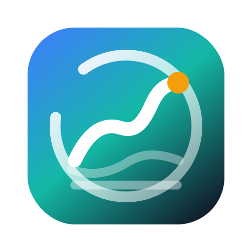
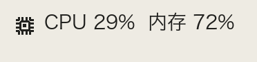
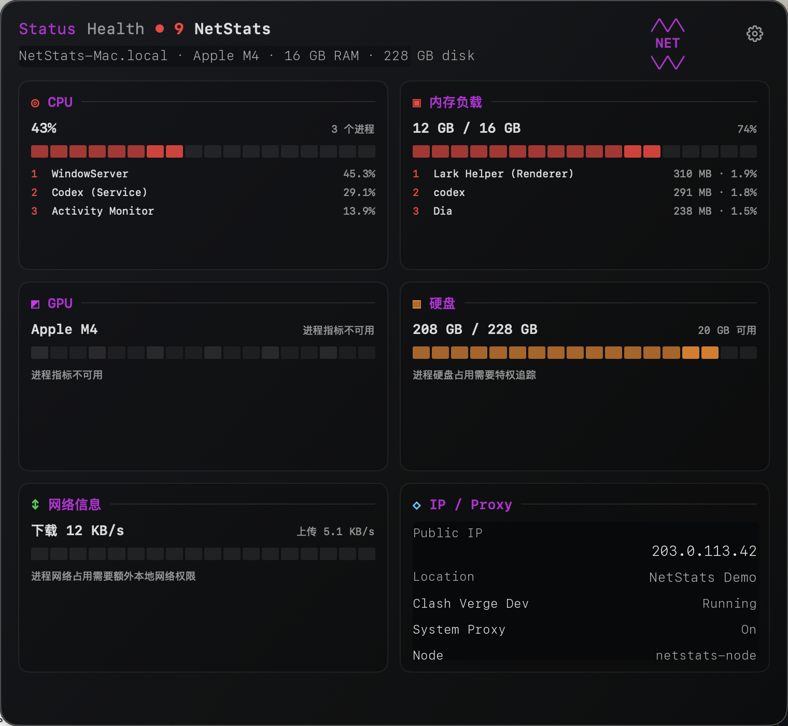

<p align="center">
  
</p>

<h1 align="center">NetStats</h1>

<p align="center">
  <strong>A native macOS menu bar monitor for CPU, memory, network speed, public IP, and Clash Verge Dev status.</strong>
</p>

<p align="center">
  <a href="README.md">中文</a> | English
</p>

<p align="center">
  <a href="https://github.com/autumncry/netstats/releases"></a>
  
  
  <a href="LICENSE"></a>
  <a href="https://github.com/autumncry/netstats/stargazers"></a>
</p>

<p align="center">
  <a href="https://github.com/autumncry/netstats/releases/latest"></a>
</p>

<p align="center">
  <a href="https://github.com/autumncry/netstats/releases/latest"></a>
</p>

## Contents

- [Install](#install)
- [Requirements](#requirements)
- [Features](#features)
- [Privacy](#privacy)
- [FAQ](#faq)
- [Build from Source](#build-from-source)
- [Contributing](#contributing)
- [License](#license)

## Install

### DMG

Download the latest `NetStats-*.dmg` from [GitHub Releases](https://github.com/autumncry/netstats/releases/latest), open it, then drag `NetStats.app` to `/Applications`.

The first public builds are unsigned. macOS may block the first launch. Open **System Settings > Privacy & Security** and allow NetStats, or Control-click the app and choose **Open**.

### npm

The npm package is prepared as `@autumncry/netstats` and will be available after the package is published to npm:

```bash
npx @autumncry/netstats install
```

The npm installer downloads the matching GitHub Release DMG and opens it. It does not install anything during `postinstall`.

## Requirements

- macOS 14.0 or later
- Apple Silicon and Intel Macs can build from source
- Clash Verge Dev status requires Clash Verge Dev to be installed and running locally

## Features

- CPU usage in the menu bar and detail panel
- Memory load, used memory, cached memory, and compressed memory
- Network upload and download speed
- Public IPv4 address, geolocation, and one-click copy
- Clash Verge Dev status: running state, system proxy, TUN, mode, subscription, proxy group, and selected node
- Configurable menu bar and hover metrics
- Native macOS AppKit + SwiftUI UI
- English and Chinese interface

## Privacy

System metrics, network speed, and Clash Verge Dev status are read and processed locally on your Mac and are never sent to any NetStats-owned server. Public IP and geolocation lookup uses `ipinfo.io` to resolve the current public egress address; if you do not need this information, you can block that request with a firewall or network filtering tool.

## FAQ

### Why does macOS say the developer cannot be verified?

The current public DMG is unsigned and not notarized. You can build from source, or allow the app from macOS Privacy & Security after confirming that it came from the official GitHub Release.

### Where does the Clash Verge Dev information come from?

NetStats reads local Clash Verge Dev configuration files, process state, macOS system proxy state, and the locally available Mihomo controller. It does not upload that information to any NetStats server.

### Why is the npm command not available yet?

The npm package source is ready in this repository, but publishing to the npm registry requires an npm login and `npm publish --access public`. Until then, use the GitHub Release DMG.

## Build from Source

```bash
git clone https://github.com/autumncry/netstats.git
cd netstats
swift build -c release
```

Package the menu bar app:

```bash
scripts/package_app.sh
open build/NetStats.app
```

Build a DMG:

```bash
scripts/package_dmg.sh
open dist
```

## Contributing

Issues and pull requests are welcome. Good areas to improve include more menu bar metrics, code signing and notarization, a Homebrew cask, and more proxy client integrations.

If NetStats helps, please consider starring the project.

## License

MIT License. See [LICENSE](LICENSE).
